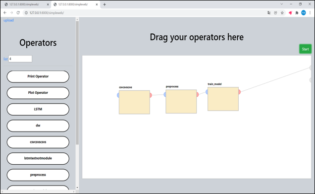
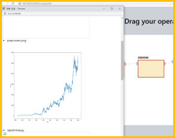

# AI 모델 학습 플랫폼

데스크탑의 리소스 대신, 회사 서버에서 모델 학습을 진행한 뒤 결과만 보여주기 위한 웹입니다.
각종 전처리 및 모델링 코드를 웹에 업로드 한 뒤, 각각의 코드를 순서대로 이어붙이면 해당 순서에 맞춰서 모델 학습이 진행됩니다.

* **Django**를 이용하여 웹사이트를 구현합니다.
* **Docker**를 이용하여 여러 언어로 구성된 코드들을 사용할 수 있도록 지원합니다.

## 개발 환경
> Django (Python, Javascript)

## 핵심 기능
> **Operator**  
  각종 오퍼레이터를 직접 서버에 추가해둔 뒤, 자유롭게 이어붙여서 사용합니다

  

> **Show interim results**  
  모든 오퍼레이터가 작동을 마무리하지 않아도, 중간 오퍼레이터의 학습 결과를 알 수 있습니다.
  

  

## 배운점
* MVC패턴에 해당하는 Django의 MTV(Model, Template, View)패턴을 따라서 프로젝트를 구성해 보았다.
* Javascript, HTML, CSS를 간단하게나마 다뤄보았다.

## 한계점
* 실제로 서버에서 돌려보지 못했다.  
    * 개인 컴퓨터에 우분투를 설치하고 Django 환경을 구성하여 웹 서버를 구동시키는것만 하였음
* 매우 짧은 개발 기간으로 인해 아쉬운 결과물을 만들었다.

## 개발 인원
* Front end: 1명
* Back end: 1명
